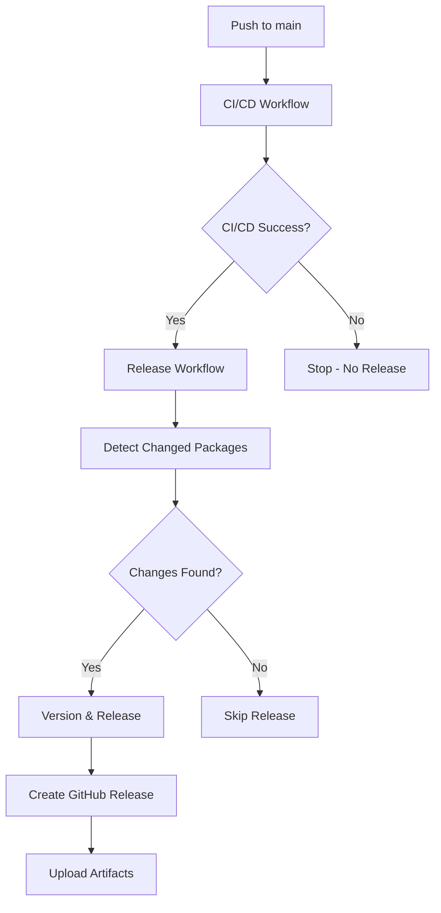

# Release Automation

## Overview

This document describes the automated release system for WeMake MCP server sub-packages. The system provides
enterprise-grade release automation with semantic versioning, comprehensive changelog generation, and integration with
existing CI/CD pipelines.

## Architecture

### Workflow Integration



### Key Components

1. **Trigger System**: Workflow runs only after successful CI/CD completion
2. **Change Detection**: Identifies modified packages since last commit
3. **Semantic Versioning**: Automatic version bumping based on commit conventions
4. **Changelog Generation**: Comprehensive release notes from commit history
5. **Artifact Packaging**: Creates distribution-ready package tarballs
6. **GitHub Integration**: Creates releases with proper tagging and assets

## Workflow Files

### Primary Release Workflow

- **File**: `.github/workflows/release.yml`
- **Trigger**: `workflow_run` on successful CI/CD completion
- **Permissions**: Minimal required (`contents: write`, `packages: write`)

### Supporting Utilities

- **File**: `.github/scripts/version-utils.ts`
- **Purpose**: Enterprise versioning logic and validation
- **Runtime**: Bun-native TypeScript execution

## Semantic Versioning Rules

### Commit Message Conventions

The release system analyzes commit messages to determine version bump types:

#### Major Version (Breaking Changes)

- `BREAKING CHANGE:` in commit body
- `feat!:` or `fix!:` (with exclamation mark)
- `breaking:` prefix
- `major:` prefix

#### Minor Version (New Features)

- `feat:` or `feature:` prefix
- `minor:` prefix

#### Patch Version (Bug Fixes)

- `fix:` prefix
- `chore:`, `docs:`, `style:`, `refactor:`, `test:` prefixes
- Any other commit types

### Examples

```sh
# Major version bump (1.0.0 → 2.0.0)
git commit -m "feat!: redesign API with new authentication system

BREAKING CHANGE: Authentication now requires OAuth2 tokens"

# Minor version bump (1.0.0 → 1.1.0)
git commit -m "feat: add new analogical reasoning capabilities"

# Patch version bump (1.0.0 → 1.0.1)
git commit -m "fix: resolve memory leak in pattern matching"
```

## Package Structure Requirements

### Required Files

- `package.json` - Package metadata and dependencies
- `README.md` - Package documentation
- `src/` - Source code directory
- `dist/` - Built artifacts (generated)

### Package.json Requirements

```json
{
  "name": "@wemake.cx/package-name",
  "version": "1.0.0",
  "description": "Package description",
  "license": "MIT",
  "type": "module",
  "main": "./dist/index.js",
  "types": "./dist/types/index.d.ts",
  "scripts": {
    "build": "bun build --entrypoints ./src/index.ts --outdir ./dist --format esm --target=bun",
    "test": "bun test"
  }
}
```

## Release Process

### Automatic Triggers

1. **Push to Main**: Developer pushes changes to `main` branch
2. **CI/CD Execution**: Standard CI/CD workflow runs (lint, test, build)
3. **Success Gate**: Release workflow only triggers on CI/CD success
4. **Change Detection**: System identifies which packages have changes
5. **Version Analysis**: Commit messages analyzed for version bump type
6. **Release Creation**: GitHub releases created with artifacts

### Manual Validation

Before pushing to main, validate your package:

```sh
# Validate package structure
bun run .github/scripts/version-utils.ts validate src/your-package

# Analyze potential version bump
bun run .github/scripts/version-utils.ts analyze src/your-package

# Run local tests
cd src/your-package
bun test
bun run build
```

## Security & Compliance

### Permissions Model

- **Least Privilege**: Workflows use minimal required permissions
- **Token Scoping**: `GITHUB_TOKEN` limited to necessary operations
- **Audit Trail**: All releases logged with commit history

### GDPR Compliance

- No personal data in release artifacts
- Commit author information preserved per Git standards
- Release metadata follows data retention policies

## Monitoring & Troubleshooting

### Success Indicators

- ✅ CI/CD workflow completes successfully
- ✅ Changed packages detected correctly
- ✅ Version bumps follow semantic versioning
- ✅ GitHub releases created with proper tags
- ✅ Artifacts uploaded successfully

### Common Issues

#### Release Workflow Not Triggering

- **Cause**: CI/CD workflow failed
- **Solution**: Check CI/CD logs, fix failing tests/builds

#### No Packages Detected for Release

- **Cause**: No changes in package directories
- **Solution**: Ensure changes are in `src/package-name/` paths

#### Version Bump Incorrect

- **Cause**: Commit messages don't follow conventions
- **Solution**: Use proper commit prefixes (`feat:`, `fix:`, etc.)

#### Release Creation Failed

- **Cause**: Insufficient permissions or duplicate tags
- **Solution**: Check `GITHUB_TOKEN` permissions, ensure unique versions

### Debugging Commands

```sh
# Check workflow status
gh run list --workflow=release.yml

# View specific run logs
gh run view <run-id> --log

# List recent releases
gh release list

# Validate package locally
bun run .github/scripts/version-utils.ts validate src/package-name
```

## Best Practices

### Development Workflow

1. **Feature Branches**: Develop in feature branches, not directly on main
2. **Commit Conventions**: Use conventional commit messages
3. **Testing**: Ensure all tests pass before merging
4. **Documentation**: Update README.md for significant changes

### Release Management

1. **Batch Changes**: Group related changes in single commits when possible
2. **Breaking Changes**: Clearly document breaking changes in commit messages
3. **Version Planning**: Consider semantic versioning impact before committing
4. **Release Notes**: Review generated changelogs for accuracy

### Package Maintenance

1. **Dependencies**: Keep dependencies up to date
2. **Security**: Regular security audits with `bun audit`
3. **Performance**: Monitor package size and build times
4. **Compatibility**: Test across supported Bun versions

## Integration with Existing Systems

### CI/CD Pipeline

- **Dependency**: Release workflow depends on successful CI/CD completion
- **Artifacts**: Reuses build artifacts from CI/CD when possible
- **Quality Gates**: Inherits quality standards from existing pipeline

### Cloudflare Workers Deployment

- **Compatibility**: Release artifacts compatible with Workers deployment
- **Environment**: Supports production and enterprise deployment targets
- **Configuration**: Integrates with existing `wrangler.toml` configurations

### Monitoring Integration

- **Alerts**: Release failures trigger appropriate notifications
- **Metrics**: Release frequency and success rates tracked
- **Audit**: All release activities logged for compliance

## Troubleshooting

### Common Issues

#### Release Workflow Not Triggering

- **Check CI/CD Status**: Ensure the main CI/CD workflow completed successfully
- **Branch Protection**: Verify pushes are made to the `main` branch
- **Permissions**: Confirm `GITHUB_TOKEN` has required permissions

#### Version Bump Failures

- **Commit Format**: Ensure commits follow conventional commit format
- **Package.json**: Verify package.json exists and has valid version field
- **Git Configuration**: Check git user.name and user.email are configured

#### Build Failures

- **Dependencies**: Run `bun install` to ensure all dependencies are installed
- **TypeScript Errors**: Check for TypeScript compilation errors
- **Test Failures**: Ensure all tests pass before release

#### Release Creation Failures

- **Token Permissions**: Verify `GITHUB_TOKEN` has `contents: write` permission
- **Tag Conflicts**: Check for existing tags with the same version
- **Asset Upload**: Ensure build artifacts exist in expected locations

### Debug Commands

```sh
# Validate release setup
bun run .github/scripts/validate-release-setup.ts

# Test release workflow
bun run .github/scripts/test-release-workflow.ts

# Check package structure
bun run build --filter=analogical-reasoning

# Validate commit format
git log --oneline -10
```

### Support

For additional support:

1. Check GitHub Actions logs for detailed error messages
2. Review the release workflow documentation
3. Contact the development team for assistance

## Future Enhancements

### Planned Features

- **Pre-release Support**: Alpha/beta release channels
- **Rollback Automation**: Automated rollback on deployment failures
- **Dependency Updates**: Automated dependency update PRs
- **Performance Tracking**: Release performance impact analysis

### Configuration Options

- **Custom Versioning**: Support for custom versioning schemes
- **Release Channels**: Multiple release channels (stable, beta, alpha)
- **Approval Gates**: Human approval for major version releases
- **Integration Hooks**: Webhook notifications for external systems

---

**Maintained by**: WeMake Enterprise Team  
**Last Updated**: 2025-08-24  
**Version**: 1.0.0
