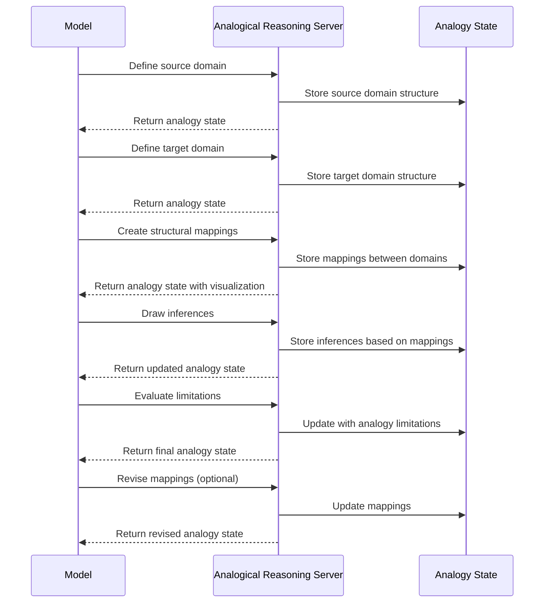

# Analogical Reasoning MCP Server

## Motivation

Analogical thinking is a powerful cognitive tool that humans use to understand new concepts by relating them to familiar
ones. While language models can use analogies, they often:

1. Apply analogies inconsistently or abandon them partway through analysis
2. Fail to explicitly map structural relationships between source and target domains
3. Overextend analogies beyond their useful boundaries
4. Miss opportunities to leverage analogical transfer for problem-solving
5. Struggle to evaluate the quality and limitations of different analogies

The Analogical Reasoning Server addresses these limitations by providing a structured framework for constructing,
mapping, and evaluating analogies. By externalizing analogical thinking, models can leverage this powerful cognitive
tool more systematically and effectively.

## Technical Specification

### Tool Interface

```typescript
interface DomainElement {
  id: string;
  name: string;
  type: "entity" | "attribute" | "relation" | "process";
  description: string;
}

interface AnalogicalMapping {
  sourceElement: string; // ID of source domain element
  targetElement: string; // ID of target domain element
  mappingStrength: number; // 0.0-1.0
  justification: string;
  limitations?: string[];
}

interface AnalogicalReasoningData {
  // Core analogy components
  sourceDoamin: {
    name: string;
    elements: DomainElement[];
  };
  targetDomain: {
    name: string;
    elements: DomainElement[];
  };
  mappings: AnalogicalMapping[];

  // Analogy metadata
  analogyId: string;
  purpose: "explanation" | "prediction" | "problem-solving" | "creative-generation";
  confidence: number; // 0.0-1.0
  iteration: number; // (integer)

  // Evaluation
  strengths: string[];
  limitations: string[];
  inferences: Array<{
    statement: string;
    confidence: number;
    basedOnMappings: string[]; // IDs of mappings supporting this inference
  }>;

  // Next steps
  nextOperationNeeded: boolean;
  suggestedOperations?: Array<
    "add-mapping" | "revise-mapping" | "draw-inference" | "evaluate-limitation" | "try-new-source"
  >;
}
```

### Process Flow



## Key Features

### 1. Explicit Domain Structuring

The server requires explicit structuring of both domains:

- **Entities**: Objects or concepts in each domain
- **Attributes**: Properties of those entities
- **Relations**: How entities relate to each other
- **Processes**: Dynamic interactions between entities

### 2. Structural Mapping

The server facilitates explicit mapping between domains:

- **Element-to-element**: Which elements correspond to each other
- **Relation-to-relation**: Preserving the structural relationships
- **Mapping strength**: Rating how well each mapping works
- **Justification**: Explanation for why the mapping is valid

### 3. Inference Generation

The server guides drawing inferences from the analogy:

- **Projection**: Transferring knowledge from source to target
- **Prediction**: Making predictions based on source domain patterns
- **Novel insights**: Identifying new perspectives on the target domain

### 4. Analogy Evaluation

Each analogy is systematically evaluated:

- **Strengths**: Where the analogy is particularly illuminating
- **Limitations**: Where the analogy breaks down
- **Confidence**: Overall assessment of analogy quality
- **Alternatives**: Considering different source domains

### 5. Visual Representation

The server provides visualization of the analogical mapping:

- Connection diagrams showing mappings between domains
- Color-coding for mapping strength
- Highlighting unmapped elements in both domains

## Usage Examples

### Complex Concept Explanation

When explaining complex technical concepts, the model can develop systematic analogies to more familiar domains, with
explicit mappings and limitations.

### Problem Solving by Analogy

For novel problems, the model can map them to familiar solved problems and transfer solution strategies.

### Creative Ideation

When generating creative ideas, the model can systematically map concepts from distant domains to generate novel
combinations.

### Scientific Modeling

For scientific concepts, the model can evaluate the strengths and limitations of different analogical models.

## Implementation

The server is implemented using TypeScript with:

- A core AnalogicalReasoningServer class
- Domain representation and visualization components
- Mapping quality evaluation algorithms
- Inference projection guidelines
- Standard MCP server connection via stdin/stdout

## Privacy & Logging Controls

- PII awareness: Analogical data may include personal data (names, IDs, free-text justifications). Before any
  visualization or logging, you must redact or aggregate such content. Treat all free-text fields as potentially
  sensitive (e.g., DomainElement.name/description, mapping.justification, inferences[].statement,
  strengths/limitations).
- Environment toggles:
  - AR_SILENT: When set to a truthy value, disables visualization emission to stderr; visualization is otherwise
    printed. See emission in [index.ts](/src/analogical-reasoning/index.ts) where visualization is written unless this
    variable is set.
  - AUDIT_LOG_LEVEL: Sets the minimal log level for your environment (e.g., error, warn, info). Used across the monorepo
    for audit logging. See guidance in [README.md](../../README.md).
  - PII_REDACTION_STRICT: When set to true, enforce strict upstream redaction before constructing
    `AnalogicalReasoningData` and before any server call. Redaction must occur in the client adapter or gateway (see
    references below).
- Data retention & deletion: This server keeps state in-memory only; no data is persisted by default. If you forward
  outputs or persist data, enforce a retention window via DATA_RETENTION_DAYS in your environment and ensure periodic
  deletion jobs. See [README.md](../../README.md) and [SECURITY.md](../../docs/SECURITY.md).
- Data subject requests (DSRs): For access/erasure requests, contact <privacy@wemake.cx> or use the DSR portal linked in
  [SECURITY.md](../../docs/SECURITY.md). Ensure request handling covers any downstream storage/log sinks integrated with
  this server.

Example: disable visualization output and minimize logs via environment variables

```env
# Disable visualization emission to stderr for this server
AR_SILENT=true

# Enterprise audit logging minimum level (example)
AUDIT_LOG_LEVEL=error

# Enforce strict upstream redaction prior to any MCP call
PII_REDACTION_STRICT=true

# Optional: retention if your environment persists logs/outputs
DATA_RETENTION_DAYS=30
GDPR_ENABLED=true
```

Redaction configuration locations

- Upstream redaction layer: Apply masking/tokenization before building AnalogicalReasoningData in your client adapter or
  gateway.
- Code emit points: Visualization surfaces at [visualizeMapping](/src/analogical-reasoning/index.ts#L320) and is written
  in [processAnalogicalReasoning](/src/analogical-reasoning/index.ts#L476). If `AR_SILENT` is set, emission is
  suppressed.
- Policies & retention: See [README.md](../../README.md) and [SECURITY.md](../../docs/SECURITY.md) for GDPR guidance
  (data minimization, purpose limitation, storage limitation, DSR handling).

This server enhances model capabilities in domains requiring creative problem-solving, explanation of complex concepts,
and transfer of knowledge between different fields or contexts.
