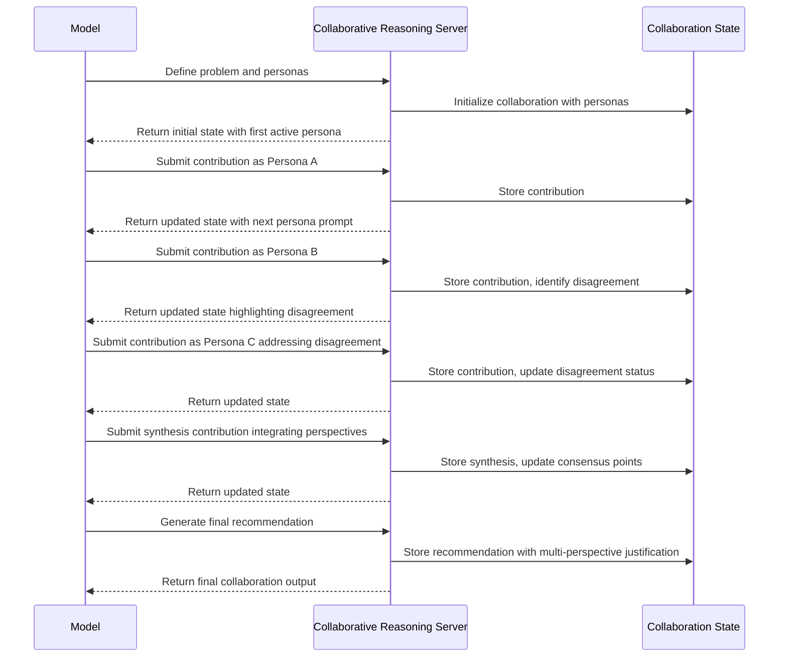

# Collaborative Reasoning MCP Server

[](https://www.npmjs.com/package/@wemake.cx/collaborative-reasoning)
[](https://opensource.org/licenses/MIT)
[](https://bun.sh/)

A Model Context Protocol (MCP) server that enables structured multi-persona collaboration for complex problem-solving.
This server creates a framework for simulating expert collaboration with diverse perspectives, systematic disagreement
management, and comprehensive insight synthesis.

## Motivation

Complex problems often benefit from diverse perspectives and expertise. While language models can attempt to simulate
different viewpoints, they often:

1. **Perspective Inconsistency**: Fail to maintain consistent, distinct perspectives throughout an analysis
2. **Lack of Productive Tension**: Struggle to create genuine productive disagreement between viewpoints
3. **Domain Blending**: Unrealistically blend different expertise domains
4. **Integration Gaps**: Neglect systematic integration of insights from different perspectives
5. **Synthesis Limitations**: Miss opportunities for creative synthesis emerging from diverse thinking

The Collaborative Reasoning Server addresses these limitations by:

- Creating structured environments for multiple simulated experts
- Maintaining consistent persona characteristics and biases
- Facilitating productive disagreements and their resolution
- Tracking cross-pollination of ideas between perspectives
- Providing visual representations of collaborative processes
- Ensuring comprehensive synthesis of diverse viewpoints

## Technical Specification

### Tool Interface

```typescript
interface Persona {
  id: string;
  name: string;
  expertise: string[];
  background: string;
  perspective: string;
  biases: string[];
  communication: {
    style: string;
    tone: string;
  };
}

interface Contribution {
  personaId: string;
  content: string;
  type: "observation" | "question" | "insight" | "concern" | "suggestion" | "challenge" | "synthesis";
  referenceIds?: string[]; // IDs of previous contributions this builds upon
  confidence: number; // 0.0-1.0
}

interface Disagreement {
  topic: string;
  positions: Array<{
    personaId: string;
    position: string;
    arguments: string[];
  }>;
  resolution?: {
    type: "consensus" | "compromise" | "integration" | "tabled";
    description: string;
  };
}

interface CollaborativeReasoningData {
  // Core collaboration components
  topic: string;
  personas: Persona[];
  contributions: Contribution[];
  disagreements?: Disagreement[];

  // Process structure
  stage: "problem-definition" | "ideation" | "critique" | "integration" | "decision" | "reflection";
  activePersonaId: string;
  nextPersonaId?: string;

  // Collaboration output
  keyInsights?: string[];
  consensusPoints?: string[];
  openQuestions?: string[];
  finalRecommendation?: string;

  // Process metadata
  sessionId: string;
  iteration: number;

  // Next steps
  nextContributionNeeded: boolean;
  suggestedContributionTypes?: string[];
}
```

### Process Flow



## Key Features

### 1. Multi-Persona Simulation

The server enables creation and management of diverse personas:

- **Expertise profiles**: Defined knowledge domains
- **Perspectives**: Unique viewpoints and priorities
- **Communication styles**: Consistent voice for each persona
- **Explicit biases**: Acknowledged limitations in each perspective

### 2. Structured Collaboration Process

The server guides a systematic collaborative process:

- **Problem definition**: Framing the challenge from multiple perspectives
- **Ideation**: Generating diverse approaches
- **Critique**: Systematic evaluation from different viewpoints
- **Integration**: Synthesizing insights across perspectives
- **Decision**: Reaching reasoned conclusions

### 3. Disagreement Management

The server provides mechanisms for productive disagreement:

- **Disagreement tracking**: Explicitly documenting differing views
- **Position mapping**: Clarifying where perspectives diverge
- **Resolution strategies**: Methods for handling disagreements
- **Structured debate**: Focused exploration of key differences

### 4. Cross-Pollination Tracking

The server tracks how ideas evolve across personas:

- **Reference links**: How contributions build on each other
- **Insight evolution**: Tracing how ideas transform
- **Integration patterns**: How diverse inputs combine

### 5. Visual Representation

The server visualizes the collaborative process:

- Contribution networks showing idea evolution
- Perspective maps highlighting agreements and disagreements
- Synthesis visualizations showing integrated insights

## Usage Examples

### Complex Problem Solving

For multifaceted problems, the model can simulate perspectives from different domains (technical, ethical, business,
legal) to develop comprehensive solutions.

### Product Design

When designing products, the model can incorporate perspectives of engineers, designers, marketers, and users to
identify optimal approaches.

### Strategic Planning

For organizational strategy, the model can simulate perspectives of different stakeholders and departments to create
more robust plans.

### Ethical Dilemma Analysis

When analyzing ethical questions, the model can represent diverse philosophical, cultural, and stakeholder perspectives.

## Architecture & Implementation

### Core Components

The server is built with enterprise-grade TypeScript and Bun runtime:

- **CollaborativeReasoningServer**: Main server class with comprehensive input sanitization and GDPR compliance
- **Persona Registry**: Manages expert personas with consistent characteristics and biases
- **Contribution Tracking**: Records all interactions with reference linking and confidence scoring
- **Disagreement Management**: Systematic tracking and resolution of conflicting viewpoints
- **Session History**: Maintains collaboration state across iterations
- **Visual Representation**: Rich console output with color-coded contributions and progress bars

### Security Features

- **Input Sanitization**: Comprehensive sanitization of all user inputs
- **Data Privacy**: Automatic redaction of sensitive information (emails, phone numbers, passwords)
- **GDPR Compliance**: Privacy-first data handling with configurable retention policies
- **Path Traversal Protection**: Prevention of directory traversal attacks
- **Script Injection Prevention**: Removal of potentially malicious script content

### Performance & Scalability

- **Bun Runtime**: High-performance JavaScript runtime with native TypeScript support
- **Memory Efficient**: Optimized data structures for large collaboration sessions
- **Concurrent Processing**: Asynchronous handling of multiple collaboration sessions
- **Comprehensive Testing**: 90%+ test coverage with unit, integration, and E2E tests

## Installation & Setup

### Prerequisites

- **Bun**: Version 1.2.0 or higher
- **Node.js**: Compatible with Node.js environments via Bun's compatibility layer
- **TypeScript**: Built-in support via Bun

### Installation

```sh
# Install via npm
npm install @wemake.cx/collaborative-reasoning

# Install via bun (recommended)
bun add @wemake.cx/collaborative-reasoning

# Install via yarn
yarn add @wemake.cx/collaborative-reasoning
```

### Development Setup

```sh
# Clone the repository
git clone https://github.com/wemake-ai/mcp.git
cd mcp/src/collaborative-reasoning

# Install dependencies
bun install

# Build the project
bun run build

# Run tests
bun test

# Start development server
bun run index.ts
```

### Configuration

The server uses standard MCP protocol configuration:

```json
{
  "mcpServers": {
    "collaborative-reasoning": {
      "command": "bun",
      "args": ["run", "@wemake.cx/collaborative-reasoning"]
    }
  }
}
```

## Dependencies

### Runtime Dependencies

- `@modelcontextprotocol/sdk`: ^1.10.2 - MCP protocol implementation
- `chalk`: ^5.3.0 - Terminal styling and colors
- `yargs`: ^17.7.2 - Command-line argument parsing

### Development Dependencies

- `@types/node`: ^22 - Node.js type definitions
- `@types/yargs`: ^17.0.32 - Yargs type definitions
- `shx`: ^0.3.4 - Cross-platform shell commands
- `typescript`: Latest - TypeScript compiler

## Testing

Comprehensive test suite with multiple testing layers:

```sh
# Run all tests
bun test

# Run specific test suites
bun test tests/unit/
bun test tests/integration/
bun test tests/e2e/
bun test tests/security/
bun test tests/performance/

# Run with coverage
bun test --coverage
```

### Test Structure

- **Unit Tests**: Core functionality and business logic
- **Integration Tests**: MCP protocol compliance and API integration
- **E2E Tests**: End-to-end collaboration scenarios
- **Security Tests**: Input sanitization and security compliance
- **Performance Tests**: Load testing and performance benchmarks

## API Reference

### Tool: `collaborativeReasoning`

The server exposes a single MCP tool for collaborative reasoning operations.

#### Input Schema

```typescript
interface CollaborativeReasoningInput {
  topic: string;
  personas: Persona[];
  contributions: Contribution[];
  disagreements?: Disagreement[];
  stage: "problem-definition" | "ideation" | "critique" | "integration" | "decision" | "reflection";
  activePersonaId: string;
  nextPersonaId?: string;
  keyInsights?: string[];
  consensusPoints?: string[];
  openQuestions?: string[];
  finalRecommendation?: string;
  sessionId: string;
  iteration: number;
  nextContributionNeeded: boolean;
  suggestedContributionTypes?: string[];
}
```

#### Output Format

```typescript
interface CollaborativeReasoningOutput {
  content: Array<{
    type: "text";
    text: string;
  }>;
  isError?: boolean;
}
```

## Contributing

We welcome contributions! Please see our [Contributing Guidelines](../../CONTRIBUTING.md) for details.

### Development Workflow

1. Fork the repository
2. Create a feature branch
3. Make your changes with tests
4. Ensure all tests pass: `bun test`
5. Build the project: `bun run build`
6. Submit a pull request

## License

MIT License - see [LICENSE](LICENSE) file for details.

## Support

- **Documentation**: [GitHub Repository](https://github.com/wemake-ai/mcp/tree/main/src/collaborative-reasoning)
- **Issues**: [GitHub Issues](https://github.com/wemake-ai/mcp/issues)
- **Discussions**: [GitHub Discussions](https://github.com/wemake-ai/mcp/discussions)

This server enhances model capabilities for complex problems requiring diverse expertise and perspectives, enabling more
thorough exploration of solution spaces and more robust final recommendations through structured collaborative
reasoning.
