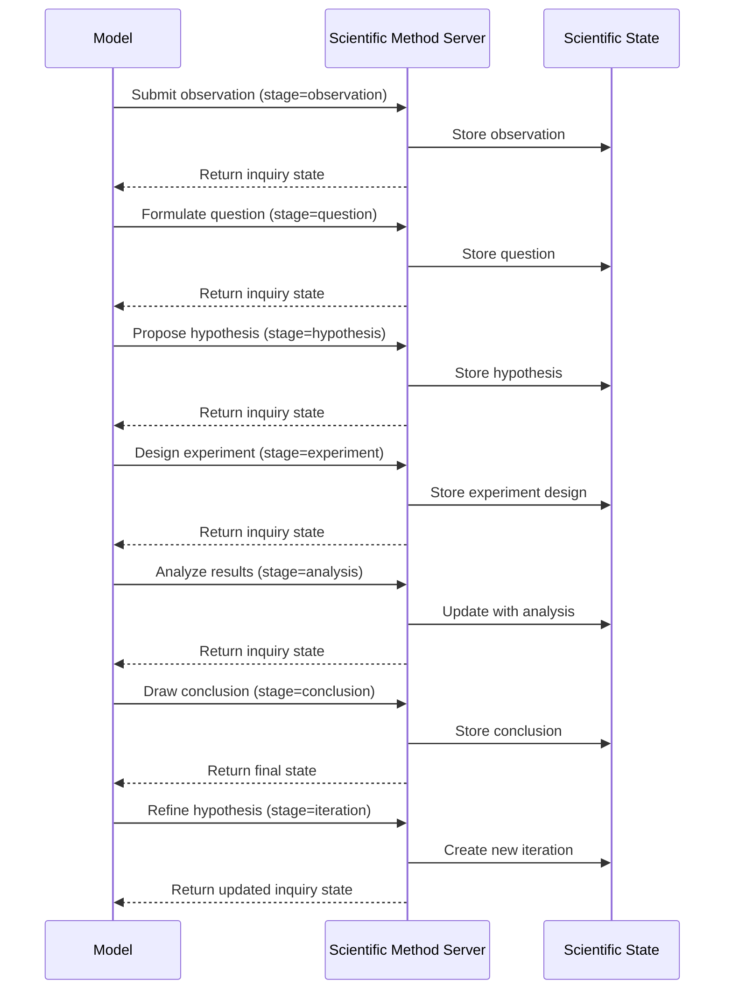

# Scientific Method MCP Server

A comprehensive framework for systematic scientific inquiry, hypothesis testing, and experimental design following
rigorous scientific methodology.

## Core Concepts

### Scientific Inquiry Process

The server implements a structured approach to scientific reasoning:

- **Observation**: Systematic data collection and pattern recognition
- **Hypothesis Formation**: Creating testable, falsifiable predictions
- **Experimental Design**: Structured methodology with proper controls
- **Data Analysis**: Systematic evaluation of experimental results
- **Conclusion Drawing**: Evidence-based reasoning and interpretation
- **Iterative Refinement**: Hypothesis revision based on findings

Example scientific inquiry:

```json
{
  "inquiry": {
    "question": "Does caffeine consumption affect cognitive performance?",
    "hypothesis": "Moderate caffeine intake (100-200mg) improves reaction time and attention span",
    "variables": {
      "independent": ["caffeine dosage"],
      "dependent": ["reaction time", "attention span", "accuracy"],
      "controlled": ["age", "sleep duration", "time of day", "environment"]
    },
    "predictions": [
      "Reaction time will decrease by 10-15% with moderate caffeine",
      "Attention span will increase by 20-30% during sustained tasks"
    ]
  }
}
```

### Hypothesis Development

Hypotheses are structured with specific criteria:

- **Testability**: Can be empirically evaluated
- **Falsifiability**: Can potentially be proven wrong
- **Specificity**: Clear, measurable predictions
- **Scope**: Defined boundaries and limitations

### Experimental Design

Experiments follow rigorous design principles:

- **Control Groups**: Proper baseline comparisons
- **Variable Isolation**: Single factor manipulation
- **Replication**: Multiple trials for reliability
- **Randomization**: Bias reduction strategies
- **Blinding**: Observer and participant bias control

### Data Analysis Framework

Systematic approach to result interpretation:

- **Statistical Significance**: Proper significance testing
- **Effect Size**: Practical significance assessment
- **Confidence Intervals**: Uncertainty quantification
- **Alternative Explanations**: Confounding factor analysis

## API

### Tools

- **scientificMethod**
  - Conducts systematic scientific inquiry with hypothesis testing and experimental design
  - Input: Comprehensive scientific inquiry data structure
    - `inquiryId` (string): Unique identifier for the scientific inquiry
    - `question` (string): Research question being investigated
    - `background` (string): Relevant background information and context
    - `hypothesis` (object): Structured hypothesis with predictions
      - `statement` (string): Clear, testable hypothesis statement
      - `rationale` (string): Reasoning behind the hypothesis
      - `predictions` (string[]): Specific, measurable predictions
      - `variables` (object): Variable classification
        - `independent` (string[]): Variables being manipulated
        - `dependent` (string[]): Variables being measured
        - `controlled` (string[]): Variables held constant
      - `testable` (boolean): Whether hypothesis can be empirically tested
      - `falsifiable` (boolean): Whether hypothesis can be proven wrong
    - `experiment` (object): Experimental design and methodology
      - `design` (string): Overall experimental design approach
      - `methodology` (string): Detailed procedural steps
      - `sampleSize` (number): Number of subjects or trials
      - `controls` (string[]): Control measures and groups
      - `measurements` (string[]): Data collection methods
      - `timeline` (string): Experimental duration and schedule
      - `limitations` (string[]): Known constraints and limitations
    - `analysis` (object): Data analysis framework
      - `statisticalMethods` (string[]): Statistical tests to be used
      - `significanceLevel` (number): Alpha level for hypothesis testing
      - `expectedOutcomes` (string[]): Anticipated results
      - `alternativeExplanations` (string[]): Potential confounding factors
    - `stage` (enum): Current stage of scientific inquiry
      - "observation" | "question" | "hypothesis" | "experiment" | "analysis" | "conclusion" | "iteration"
    - `iteration` (number): Current iteration of the inquiry process
    - `confidence` (number): Confidence level in current findings (0.0-1.0)
    - `nextStageNeeded` (boolean): Whether progression to next stage is required
    - `suggestedNextSteps` (string[]): Recommended actions for continuation
  - Output: Structured scientific analysis with methodology validation
    - Complete inquiry documentation with all stages
    - Hypothesis evaluation and testing framework
    - Experimental design validation and recommendations
    - Statistical analysis plan and interpretation guidelines
  - Supports iterative scientific inquiry with stage progression

## Setup

### bunx

```json
{
  "mcpServers": {
    "Scientific Method": {
      "command": "bunx",
      "args": ["@wemake.cx/scientific-method@latest"]
    }
  }
}
```

#### bunx with custom settings

```json
{
  "mcpServers": {
    "Scientific Method": {
      "command": "bunx",
      "args": ["@wemake.cx/scientific-method@latest"],
      "env": {
        "INQUIRY_DEPTH": "comprehensive",
        "STATISTICAL_RIGOR": "high",
        "HYPOTHESIS_VALIDATION": "strict",
        "EXPERIMENTAL_CONTROLS": "extensive"
      }
    }
  }
}
```

- `INQUIRY_DEPTH`: Level of scientific inquiry detail ("basic" | "standard" | "comprehensive")
- `STATISTICAL_RIGOR`: Statistical analysis requirements ("low" | "medium" | "high")
- `HYPOTHESIS_VALIDATION`: Hypothesis validation strictness ("lenient" | "standard" | "strict")
- `EXPERIMENTAL_CONTROLS`: Control requirement level ("minimal" | "standard" | "extensive")

## System Prompt

The prompt for utilizing scientific methodology should encourage rigorous inquiry:

```markdown
Follow these steps for scientific inquiry:

1. Observation and Question Formation:
   - Identify patterns or phenomena requiring investigation
   - Formulate clear, specific research questions
   - Gather relevant background information and prior research

2. Hypothesis Development:
   - Create testable, falsifiable hypotheses
   - Define independent, dependent, and controlled variables
   - Make specific, measurable predictions
   - Ensure hypotheses are grounded in existing knowledge

3. Experimental Design:
   - Design controlled experiments with proper methodology
   - Include appropriate control groups and sample sizes
   - Plan data collection methods and measurement protocols
   - Identify potential limitations and confounding factors

4. Data Analysis and Interpretation:
   - Apply appropriate statistical methods
   - Evaluate results against predictions and significance thresholds
   - Consider alternative explanations and confounding variables
   - Draw evidence-based conclusions with appropriate confidence levels

5. Iterative Refinement:
   - Revise hypotheses based on experimental findings
   - Design follow-up experiments to address limitations
   - Build upon results to advance scientific understanding
```

## Example

```typescript
// Conduct a comprehensive scientific inquiry
const scientificInquiry = await scientificMethod({
  inquiryId: "caffeine-cognitive-performance-study",
  question: "Does caffeine consumption affect cognitive performance in healthy adults?",
  background:
    "Previous studies suggest caffeine may enhance alertness and reaction time, but effects on complex cognitive tasks remain unclear",
  hypothesis: {
    statement:
      "Moderate caffeine intake (100-200mg) will improve reaction time and sustained attention in healthy adults aged 18-35",
    rationale: "Caffeine blocks adenosine receptors, reducing drowsiness and potentially enhancing cognitive function",
    predictions: [
      "Reaction time will decrease by 10-15% compared to placebo",
      "Sustained attention scores will increase by 20-25%",
      "Working memory performance will show modest improvement (5-10%)"
    ],
    variables: {
      independent: ["caffeine dosage (0mg, 100mg, 200mg)"],
      dependent: ["reaction time (ms)", "sustained attention score", "working memory accuracy (%)"],
      controlled: ["age (18-35)", "sleep duration (7-9 hours)", "time of testing (9-11 AM)", "fasting state (12 hours)"]
    },
    testable: true,
    falsifiable: true
  },
  experiment: {
    design: "Double-blind, placebo-controlled, within-subjects design",
    methodology: "Participants complete cognitive battery 60 minutes after consuming caffeine/placebo capsules",
    sampleSize: 60,
    controls: ["Placebo group (0mg caffeine)", "Randomized order of conditions", "Standardized testing environment"],
    measurements: [
      "Psychomotor Vigilance Task (PVT)",
      "Sustained Attention to Response Task (SART)",
      "N-back working memory task"
    ],
    timeline: "3 sessions per participant over 3 weeks, minimum 48-hour washout between sessions",
    limitations: [
      "Limited to healthy adults",
      "Single-dose acute effects only",
      "Laboratory setting may not reflect real-world performance"
    ]
  },
  analysis: {
    statisticalMethods: ["Repeated measures ANOVA", "Post-hoc pairwise comparisons with Bonferroni correction"],
    significanceLevel: 0.05,
    expectedOutcomes: [
      "Significant main effect of caffeine dose",
      "Linear dose-response relationship for reaction time"
    ],
    alternativeExplanations: ["Placebo effect", "Practice effects", "Individual differences in caffeine metabolism"]
  },
  stage: "hypothesis",
  iteration: 1,
  confidence: 0.75,
  nextStageNeeded: true,
  suggestedNextSteps: ["Finalize experimental protocol", "Obtain ethical approval", "Recruit participants"]
});
```

### Process Flow



## Key Features

### 1. Structured Scientific Process

The server enforces a structured scientific inquiry process:

- **Observation**: Making and recording observations about phenomena
- **Question**: Formulating specific, testable questions
- **Hypothesis**: Creating falsifiable hypotheses with variables
- **Experiment**: Designing controlled tests with predictions
- **Analysis**: Evaluating results against predictions
- **Conclusion**: Drawing warranted conclusions
- **Iteration**: Refining hypotheses based on results

### 2. Hypothesis Management

Hypotheses must be explicitly formulated with:

- **Statement**: Clear, testable proposition
- **Variables**: Identified and categorized (independent, dependent, etc.)
- **Assumptions**: Explicit underlying assumptions
- **Alternatives**: Competing explanations for same phenomena

### 3. Experimental Design

The server guides rigorous experimental design:

- **Methodology**: Clear procedural steps
- **Predictions**: Explicit if-then statements for expected outcomes
- **Controls**: Measures to eliminate confounding variables
- **Limitations**: Acknowledged constraints of the design

### 4. Evidence Evaluation

Evidence is systematically evaluated:

- **Confirmatory**: Evidence supporting hypotheses
- **Disconfirmatory**: Evidence challenging hypotheses
- **Unexpected**: Observations not predicted by hypotheses

### 5. Iteration Tracking

The server tracks how scientific understanding evolves:

- History of hypothesis refinements
- Changing confidence levels based on evidence
- Alternative explanations explored and rejected

## Usage Examples

### Causal Analysis

When attempting to determine cause-effect relationships, the model can systematically work through alternative
explanations and evidence evaluation.

### Technical Troubleshooting

For diagnosing problems, the model can generate competing hypotheses about failure causes and design tests to
differentiate between them.

### Literature Review

When synthesizing research findings, the model can systematically evaluate evidence quality and competing explanations.

### Health Diagnosis

For medical reasoning, the model can track hypothesis confidence for different conditions based on symptoms and test
results.
