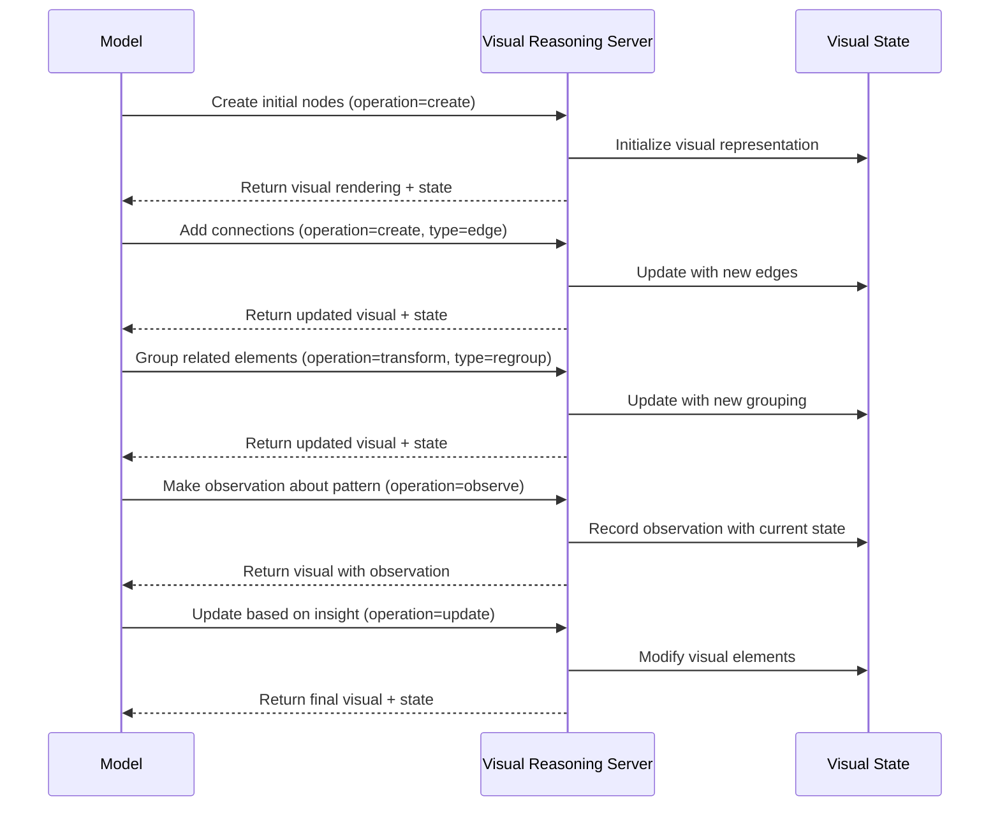

# Visual Reasoning MCP Server

The Visual Reasoning MCP Server provides structured spatial and visual reasoning capabilities for language models. It
enables systematic analysis of visual elements, spatial relationships, geometric transformations, and coordinate-based
operations through ASCII visualization and mathematical computation.

## Overview and Purpose

### Core Concepts

**Visual Element Management**

- Support for geometric primitives: points, lines, rectangles, circles, polygons, and text
- Coordinate-based positioning with properties like dimensions, colors, and metadata
- Canvas-based coordinate system with configurable dimensions and scaling

**Spatial Reasoning Framework**

- Distance calculations and proximity analysis between visual elements
- Overlap detection and containment relationships
- Alignment analysis for layout optimization
- Multi-step geometric transformations (translate, scale, rotate)

**Visual Analysis Capabilities**

- ASCII diagram generation for spatial visualization
- Coordinate-based mathematical analysis
- Descriptive spatial relationship reporting
- Canvas state management and element tracking

## Capabilities

### Tools

#### `visualReasoning`

**Description**: Performs visual reasoning operations on spatial elements with coordinate-based analysis and ASCII
visualization.

**Input Schema**:

```json
{
  "operation": "create | move | resize | rotate | delete | query | analyze",
  "elements": [
    {
      "id": "string",
      "type": "point | line | rectangle | circle | polygon | text",
      "position": { "x": "number", "y": "number" },
      "properties": {
        "width": "number (optional)",
        "height": "number (optional)",
        "radius": "number (optional)",
        "color": "string (optional)",
        "text": "string (optional)",
        "vertices": "array of {x, y} (optional)"
      },
      "metadata": "object (optional)"
    }
  ],
  "canvas": {
    "width": "number",
    "height": "number",
    "scale": "number (optional)"
  },
  "transformations": [
    {
      "type": "translate | scale | rotate",
      "parameters": "object with transformation values"
    }
  ],
  "spatialQueries": [
    {
      "type": "distance | overlap | containment | alignment",
      "elementIds": "array of element IDs"
    }
  ],
  "visualizationMode": "ascii | coordinates | description",
  "nextOperationNeeded": "boolean"
}
```

**Output**: Visual analysis results with ASCII diagrams, spatial calculations, and element state updates.

**Error Cases**: Invalid coordinates, unsupported element types, canvas boundary violations, transformation failures.

## Setup

### bunx

```json
{
  "mcpServers": {
    "Visual Reasoning": {
      "command": "bunx",
      "args": ["@wemake.cx/visual-reasoning@alpha"]
    }
  }
}
```

### Environment Variables

- `VISUAL_CANVAS_WIDTH` (default: "800"): Default canvas width in pixels
- `VISUAL_CANVAS_HEIGHT` (default: "600"): Default canvas height in pixels
- `VISUAL_ASCII_SCALE` (default: "10"): Scale factor for ASCII visualization
- `VISUAL_PRECISION` (default: "2"): Decimal precision for coordinate calculations
- `VISUAL_MAX_ELEMENTS` (default: "100"): Maximum elements per canvas
- `VISUAL_LOG_LEVEL` (default: "info"): Logging level (debug, info, warn, error)

### System Prompt Template

```markdown
You have access to a Visual Reasoning MCP Server that provides spatial analysis and visual reasoning capabilities.

Use this server to:

- Analyze spatial relationships between visual elements
- Perform geometric transformations and calculations
- Generate ASCII visualizations of spatial layouts
- Solve coordinate-based positioning problems
- Validate spatial constraints and alignments

The server supports points, lines, rectangles, circles, polygons, and text elements with full coordinate-based
positioning and property management.
```

## Example

```typescript
// Creating a spatial layout analysis for UI components
const layoutAnalysis = {
  operation: "create",
  elements: [
    {
      id: "header",
      type: "rectangle",
      position: { x: 0, y: 0 },
      properties: {
        width: 800,
        height: 80,
        color: "blue"
      },
      metadata: { component: "navigation" }
    },
    {
      id: "sidebar",
      type: "rectangle",
      position: { x: 0, y: 80 },
      properties: {
        width: 200,
        height: 520,
        color: "gray"
      },
      metadata: { component: "menu" }
    },
    {
      id: "main-content",
      type: "rectangle",
      position: { x: 200, y: 80 },
      properties: {
        width: 600,
        height: 520,
        color: "white"
      },
      metadata: { component: "content" }
    },
    {
      id: "logo",
      type: "circle",
      position: { x: 50, y: 40 },
      properties: {
        radius: 25,
        color: "red"
      },
      metadata: { component: "branding" }
    }
  ],
  canvas: {
    width: 800,
    height: 600,
    scale: 1.0
  },
  spatialQueries: [
    {
      type: "overlap",
      elementIds: ["header", "sidebar"]
    },
    {
      type: "containment",
      elementIds: ["header", "logo"]
    },
    {
      type: "alignment",
      elementIds: ["sidebar", "main-content"]
    }
  ],
  visualizationMode: "ascii",
  nextOperationNeeded: false
};

// Performing geometric transformation
const transformOperation = {
  operation: "move",
  elements: [
    {
      id: "logo",
      type: "circle",
      position: { x: 100, y: 40 }, // New position
      properties: {
        radius: 25,
        color: "red"
      }
    }
  ],
  transformations: [
    {
      type: "translate",
      parameters: {
        deltaX: 50,
        deltaY: 0,
        elementId: "logo"
      }
    }
  ],
  visualizationMode: "coordinates",
  nextOperationNeeded: false
};
```

### Process Flow



## Key Features

### 1. Multi-Modal Representation System

The server supports different visual representation types:

- **Graphs**: For relationship networks and connection patterns
- **Flowcharts**: For processes and sequential operations
- **State Diagrams**: For system states and transitions
- **Concept Maps**: For knowledge organization and relationships
- **Tree Diagrams**: For hierarchical structures

### 2. Abstract Visual Element Manipulation

Models can manipulate visual elements through operations:

- **Create**: Add new elements to the visual space
- **Update**: Modify existing elements
- **Delete**: Remove elements
- **Transform**: Apply operations to multiple elements (regrouping, restructuring)
- **Observe**: Make and record observations about visual patterns

### 3. Iterative Refinement

The server tracks iteration history, allowing models to:

- See how their visual representation evolved
- Revert to previous states if needed
- Compare different visualization approaches

### 4. Visual-Verbal Integration

The server enables bidirectional translation between:

- Verbal descriptions and visual representations
- Visual patterns and verbal insights
- Diagrammatic reasoning and textual conclusions

### 5. Visual Output

The server provides multiple representations:

- ASCII art for terminal-based visualization
- SVG or DOT format for more complex diagrams
- Textual descriptions of the visual state for accessibility

## Usage Examples

### System Architecture Design

Models can create and manipulate component diagrams showing data flow, dependencies, and interactions between system
components.

### Algorithm Visualization

When designing or explaining algorithms, models can create flowcharts, state diagrams, or visual traces of execution.

### Concept Mapping

For organizing complex domains of knowledge, models can create and refine concept maps showing relationships between
ideas.

### Pattern Recognition

When analyzing data, models can create visual representations to identify patterns that might be difficult to detect in
text.
